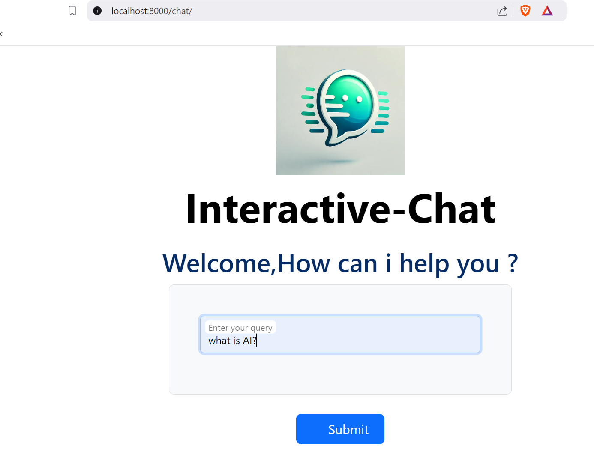
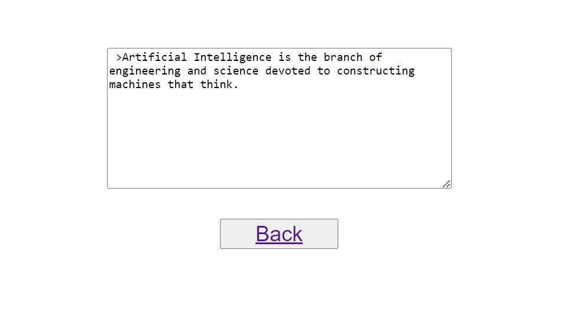

<h2 align="center"><b>Interactive Chat</b></h2>
<h4 align="center">Software application that simulates text conversations</h4>

## Interactive chat 
Interactive chat can provide real-time customer support which can be a valuable asset in many industries .It supports general conversations, you can build and train a self-learning interactive chat with real user data. 

## feature:
✓ AI driven response  
✓ Trained with custom data  
✓ UI design

## Getting Started:
To run or contribute to this project, follow the steps below.

## Prerequisites:
✓ python

✓ pip

✓ Chatterbot library

## Build:
1. Create an virtual environment using python -m venv [your virtual envi name] in the powershell.

2. Install chatterbot library version 1.0.4 using python -m pip install chatterbot==1.0.4 pytz

3. Install python version 3.7.9 since the chatterbot library doesn't support the latest version of python try to download the python version 3.7 or below

4. Activate your virtual environment using [your virtual envi name]\scripts\activate.bat

5. Inside your virtual environment install py -m pip install Django

6. Create a project inside your virtual environment using django-admin startproject [your project name]

7. Change to your project folder and create an app using py manage.py startapp [app name]

8. Run the server using py manage.py runserver

9. Open a new browser window and type 127.0.0.1:8000 in the address bar. To see the results.

10. Clone this repository.

11. We are using some static files in this project. Static files are not handled automatically in Django when DEBUG = False in setting.py

12. To handle static files we need to install WhiteNoise using pip install whitenoise.

13. Once whitenoise is installed, we need to collect all static files using py manage.py collectstatic.

note: Before collecting make sure to mention the Root directory for static files in setting.py.

## Screenshots

   
   

  

